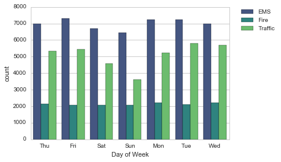
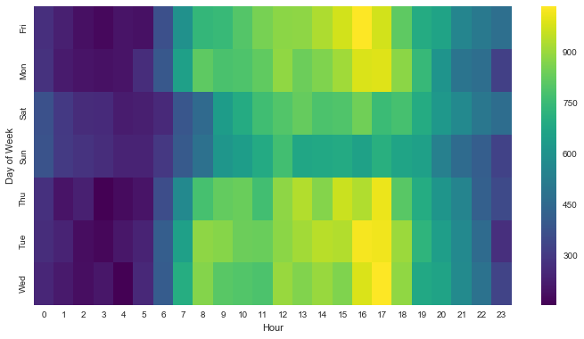

# Data-Capstone-Project---911-calls
Perform analytics on 911 calls(Police calls in the USA),
(*For what reason are the people of USA calling their police)
find amazing insights and improve your journey of becoming a data analyst.

## The output is directly printed in the python notebook open and analyse..!!!

### Some analytics observed from this dataset.

